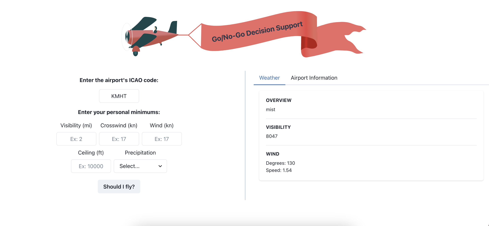

# Go/No-Go Decision Support Tool
An application that supports general aviation pilots in making an informed decision on whether conditions are safe to proceed with a flight (go) or if it is better to delay or cancel (no-go) based on a variety of factors.

## Important Disclaimer 
This tool is provided for informational and educational purposes only. It is not a substitute for proper pilot training, official weather briefings, aviation regulations, and sound judgment. The use of this tool does not guarantee the safety of any flight or replace the responsibility of the pilot-in-command.

## Development
This app was built using Next.js.

1. Install dependencies\
`npm install`

2. Run the development server\
`npm run dev`

2. Open http://localhost:3000 from your browser.